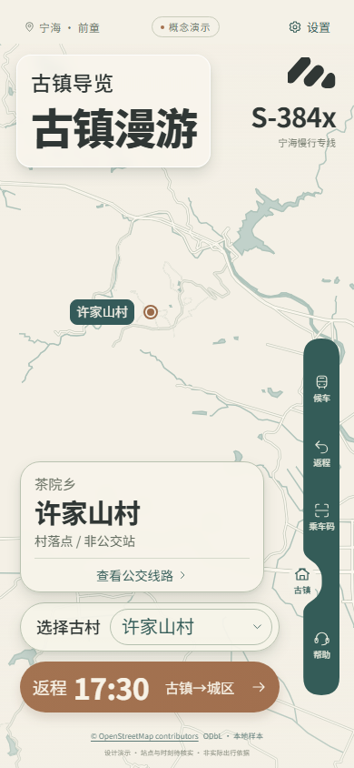

# 乡序 2.0 · 手机公共交通 APP 原型

[在线 Demo](https://private200516.github.io/baixi-yuji/#/ride) · [古镇地图](https://private200516.github.io/baixi-yuji/#/town) · [2.0.1 下载与更新说明](https://github.com/private200516/baixi-yuji/releases/tag/v2.0.1)

**2.0.1 修复：**进入和离开古镇时，导航条的位置、高度、图标间距与圆座颜色连续过渡，保持两种页面原有的最终布局。快速点击可从当前位置转向；系统及应用减少动效设置依然立即生效。

按用户最新参考图，**古镇页改为地图铺底、悬浮信息卡、选村胶囊与返程入口**；配合统一的页面退场、分层入场和控件反馈。小/中/大字号统一收进“设置 → 文字大小”。原页面布局和操作逻辑保持原样。当前入口为 `src/mobile/TransitApp.tsx`，产品名为“乡序”。

## 当前界面

- 原五项右侧凹槽导航：候车、返程、乘车码、古镇、帮助。
- 原八个页面：`ride`、`return`、`scan`、`route`、`ticket`、`town`、`help`、`delay`。
- 原候车方向、附近站点搜索、收藏、返程时段与返程卡、演示二维码与车票、帮助与异常重试操作不变。
- 小/中/大字号仅在设置中选择，仍影响所有页面并保存在本机；独立老年人模式与本地偏好保留。
- 保留原排版与字体。乡序与新增村名使用原同款字体的补充字形；通过Unicode范围限制，只补旧字体子集缺少的123个字符，不替换原有字形。

候车页 `RouteRiver` 仍是点击进入线路详情的示意图，不把演示站点绑定到真实地理坐标。

## 古镇地图场景

`src/mobile/TownScene.tsx` 是古镇页的独立场景：全幅暖米白真实地图，顶部导览卡与线路标识，右侧原五项凹槽导航，底部村落信息、文字选村和陶土色返程入口。地图继续使用本地 WGS84 道路、水系与五个已登记村落代表点；不会为接近参考图而虚构河流、道路或站点。

选村复用同一个地图实例，以720ms平滑移动到新村落；测量悬浮控件尺寸，使点位保持在上方标题和底部卡片之间。卡片分层淡入、内容轻移，原凹槽与圆座480ms同步移动，图标保留固定排列位置。尊重系统减少动态效果、应用设置及老年模式。

“查看公交线路”仍进入原线路详情，返程入口仍进入原返程页。选择古村保留在应用状态内。MapLibre/WebGL失败时仍能用文字列表选择村落；底图保留OpenStreetMap署名和ODbL许可。

场景样式只作用于古镇页面，不加载历史 `geography.css` 或 `mobile-product.css`。历史卡片地图封装 `GeographicTownMap.tsx` 保留，但当前古镇页使用场景布局。当前视图为平面真实地图，没有虚构建筑或地形。

原公交业务页面依旧是明确标注的概念演示，站点、时间、车票与二维码不是已核实的运营服务。此前道路研究数据和广泛重排的 `src/geography/MobileApp.tsx` 保留为阶段记录，**不再作为当前APP入口**。

## 统一动效与设置

页面字号按钮已移除，设置中的三档字号控件用连续滑动的选中底座反馈选择。帮助文案同步指向设置入口。

`useScreenMotion.ts` 保持右侧导航即时响应，旧内容120ms轻移淡出后，新内容分层进入；连续点击只进入最终选择的页面。`SheetPanel.tsx` 保持弹层模态与焦点到170ms退出结束，避免关闭时突然消失。按压反馈、数字更新、票根入场、线路描绘和扫描线都在 `ui-motion.css` 统一；不增加动画库。减少装饰性循环、数值模糊和发光，扫描码本身保持静止。

系统减弱动效、应用“减少动态效果”及老年模式同时抑制CSS和JavaScript过渡。验收见 [UI动效检查](docs/ui-motion-validation.md) 与 [2.0.1导航过渡检查](docs/navigation-motion-validation.md)。

## 运行

Node.js 24、pnpm 11.25.0；不需要API Key或付费接口。

```sh
pnpm install --frozen-lockfile
pnpm dev
```

Windows可使用 `pnpm.cmd`。开发预览：http://127.0.0.1:5173/#/ride ，地图位于 http://127.0.0.1:5173/#/town 。

```sh
pnpm typecheck
pnpm test
pnpm test:ui-motion
pnpm test:navigation-motion
pnpm build
pnpm preview
```

浏览器回归需先运行开发服务器，默认使用本机Edge，可用 `PLAYWRIGHT_CHANNEL`、`PREVIEW_URL` 指定通道与地址。生产预览为 http://127.0.0.1:4173/ 。

本轮浏览器结果与截图使用 `docs/ui-motion-*`，生产子路径检查为 `node tests/ui-motion-production.mjs`。`town-scene-*`保留上一轮古镇布局验收记录，其字号入口断言属于当时设计。旧 `map-only-*`、`round2-*`、地理重排测试及截图是历史记录，不代表当前场景的验收。

## 数据及交付

地图运行只请求本地资源，不调用公共瓦片、Overpass或设备定位。来源、许可、数据时刻、查询及哈希见：

- [数据来源](docs/data-sources.md)
- [村落核验](docs/village-verification.md)
- [地图局部数据](docs/map-depth-data.md)
- [本轮范围与验收](docs/town-scene-validation.md)
- [以前的GitHub与Figma交付记录](docs/previous-release-readme.md)

2.0源码位于 `main`，静态Demo通过 `gh-pages` 发布，当前修复见 [v2.0.1](docs/releases/v2.0.1.md)，初版变更见 [v2.0.0](docs/releases/v2.0.0.md)。旧版保留；`design/` 为旧版设计交付资料，本次没有更新线上Figma。


