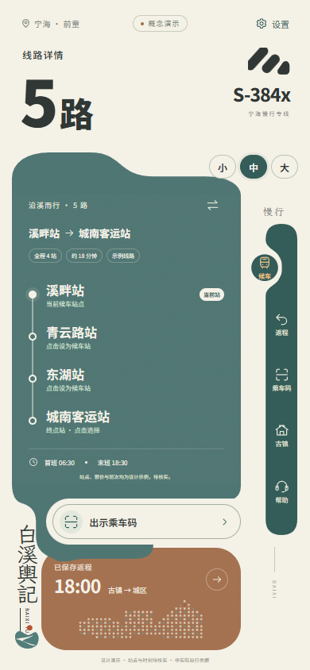

# 白溪舆记 · 手机公共交通 APP

基于 `export.zip` 效果图制作的 React + TypeScript 交互原型。米白、灰青、陶赭曲面；右侧竖向导航；手机主页面一屏完整展示，无底部导航、无需下拉。

手机端主页面一屏显示，保留右侧凹槽跟随导航、全局字号和独立老年人模式。桌面端为手机外观的可交互展示。

[在线 DEMO](https://private200516.github.io/baixi-yuji/#/ride) · [GitHub 源码](https://github.com/private200516/baixi-yuji) · [下载交付包](https://github.com/private200516/baixi-yuji/releases/tag/v0.1.0)

设计资料位于 [design/](design/README.md)：15 个手机画板的实际 PNG、可编辑 SVG 及文字/坐标/矢量 JSON 数据。SVG 已内嵌字体，但并非 Figma 原生 `.fig` 文件；原生 Figma 文件仍待选择目标团队后创建。



## 运行

需要 Node.js 24 与 pnpm 11.25.0。Windows PowerShell 若限制脚本执行，可将下面的 `pnpm` 写成 `pnpm.cmd`。

```sh
npm install --global pnpm@11.25.0
pnpm install --frozen-lockfile
pnpm dev
```

打开 http://127.0.0.1:5173/#/ride 。普通启动不需要 API Key、后端或原始字体文件。

## 检查与构建

```sh
pnpm typecheck
pnpm test
pnpm build
pnpm preview
```

生产预览地址为 http://127.0.0.1:4173/#/ride ，构建产物在 `dist/`。

浏览器检查前，在另一个终端运行 `pnpm dev`，然后：

```sh
pnpm exec playwright install chromium
pnpm test:browser
pnpm test:visual
pnpm test:groove
pnpm test:accessibility
pnpm test:production
```

Linux 首次安装可使用 `pnpm exec playwright install --with-deps chromium`。可选环境变量：`PREVIEW_URL` 指向其他测试地址；`PLAYWRIGHT_CHANNEL=chrome` 使用已安装的 Google Chrome；`PLAYWRIGHT_MODULE` 指向已有 Playwright 模块。默认使用项目锁定的 Playwright 及其 Chromium，不依赖特定电脑路径。`pnpm test` 保留旧阶段独立数据模块的回归检查。

## GitHub 与 DEMO

源码位于 `main` 分支，已构建的静态 DEMO 位于 `gh-pages` 分支。GitHub Pages 使用 **Deploy from a branch → gh-pages → /(root)** 发布。站点地址为 https://private200516.github.io/baixi-yuji/ 。修改源码后，需要重新构建并更新 `gh-pages` 才会改变线上页面。

仓库附带 `docs/github-pages-workflow.yml` 自动部署模板。它尚未启用：当前上传凭据允许推送源码，但不允许创建 GitHub Actions 工作流。若后续需要自动部署，可通过有工作流权限的账号将模板保存为 `.github/workflows/pages.yml`，再把 Pages 来源改为 **GitHub Actions**。

页面采用 hash 路由与相对资源路径，适合 GitHub Pages 项目子目录。部署检查及打包说明见 [GitHub 交付说明](docs/GITHUB_DELIVERY.md)。

## 已实现

- 候车、返程、乘车码、线路详情、电子样票、古镇导览、帮助、异常状态八个页面。
- 右侧五项凹槽跟随导航；小/中/大全局字号（90% / 100% / 118%），涵盖所有页面和弹层；站点搜索和方向切换。
- 设置中的老年人模式：独立的简明首页、四个大按钮、明确的返回首页、当前页面语音朗读；默认大字号并减少动效，退出恢复原字号。
- 本机收藏、返程卡保存/移除、示例票面刷新、帮助弹层。
- 曲面入场、线路绘入与移动光点、同步移动的侧栏凹槽和圆形底座、扫描光带、点阵、票面和弹层动效。
- 系统/应用「减少动态效果」、弹层键盘关闭和焦点归还。
- 本地字体：Noto Sans SC + 霞鹜文楷，WOFF2 子集约 212 KB。原包无字体，采用视觉接近的替代。

96 组普通手机页面/字号/尺寸、48 组老年人页面检查通过；覆盖 320×568、360×740、390×844、430×932。另有 192 组凹槽与排版检查，包括内嵌浏览器和桌面预览。适老检查涵盖全局文字逐档增大、模式记忆、返程保存、一键返回与按钮触控尺寸（手机至少 44×44 CSS px）。当前验证为 Chrome 模拟视口，非真机认证。

## 文件

- `src/mobile/TransitApp.tsx`：当前界面与状态。
- `src/mobile/TransitArt.tsx`：矢量标志、站线、点阵、导览地图。
- `src/mobile/transit.css`：视觉和动效。
- `src/mobile/single-screen.css`：右侧导航和随高度变化的一屏布局。
- `src/mobile/GrooveNavigation.tsx`、`groove-navigation.css`：连续 U 形凹槽、同步圆形底座与内容区高度适配。
- `src/mobile/FontSizeControl.tsx`、`accessibility.css`：统一字号、设置与按钮/返程卡适配。
- `src/mobile/SeniorExperience.tsx`：独立的老年人模式。
- `public/fonts/`：本地字体与许可；`public/art/`：无效演示 QR。
- `docs/MOBILE_DESIGN.md`：设计说明、数据边界、字体来源和验证范围。
- `docs/mobile-browser-results.json`、`docs/mobile-layout-check.json`：测试记录。
- `docs/mobile-screenshots/`：实际运行截图。
- `dist/`：生产构建。

这是交互设计原型，站点、时刻、地图和二维码为演示；未接入实时公交、定位、支付、客服、车票核验或通知。设置仅保存在当前浏览器，不会上传个人数据。字体遵循 `public/fonts/` 中各自的 OFL 许可；本项目未额外授予代码或视觉设计的开源许可。

原始效果图、原始 TTF、开发任务记录和本机工具不随源码仓库发布。网页所需字体子集和演示素材已经包含；需要重新生成字体时见设计说明。
