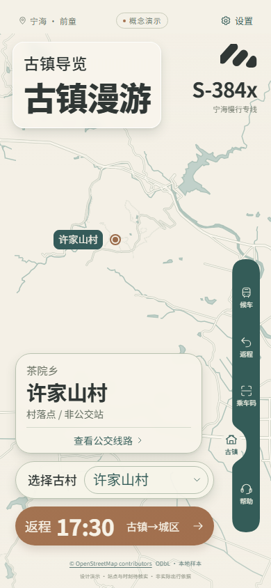
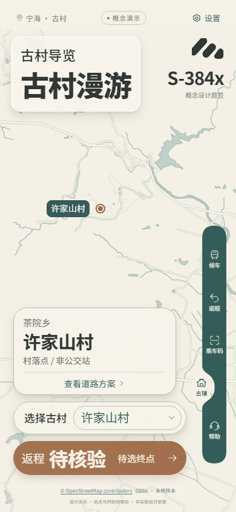
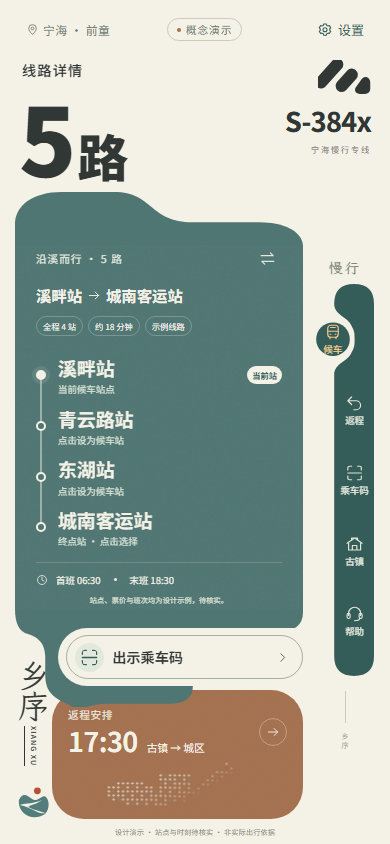
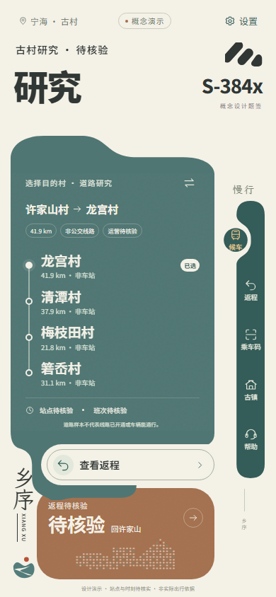
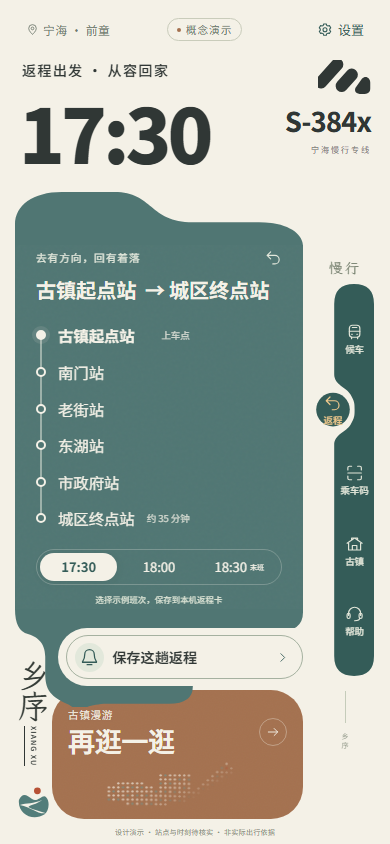
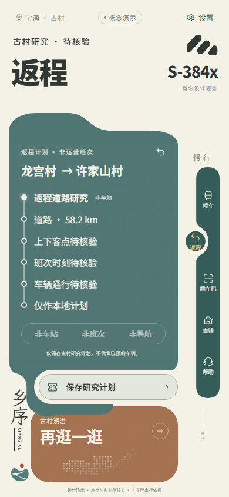

# 古村研究行程联动 · 2.1.0

日期：2026-10-09。审查基线为 `9a5651a083f204ac2963159576752434f11c4d4c`（v2.0.1）。开始时HEAD与基线一致，没有未提交的已跟踪源码改动；既有未跟踪资料与截图保留。修改前在独立Edge上下文重新拍摄9张截图，拍摄前后6份核心源码SHA-256一致，详见[基线记录](journey-link/before/baseline.json)。

## 增量范围与文件

本轮执行“选中古村—道路研究方案—返程—本地计划”一条链路。保留当前入口，既有五项导航、CSS、字体、SVG、动效、地图引擎、默认平面地图、老年模式及桌面结构未改。

| 文件 | 增量 |
| --- | --- |
| `src/data/demoTransit.ts` | 提取原演示站点与时刻，与研究数据隔离 |
| `src/mobile/journey.ts` | 统一选择、起终点、路线ID、方向；校验研究数据与存储，迁移旧记录 |
| `src/mobile/useJourney.ts` | 请求取消与超时、错误状态、本地保存/删除及失败反馈 |
| `src/mobile/ResearchPanels.tsx` | 复用原四行线路与六行返程内容槽，提供研究选村和状态文案 |
| `src/mobile/TransitApp.tsx` | 串接事件、地图参数、方向、原保存按钮与弹层；原偏好独立保留 |
| `src/mobile/TownScene.tsx` | 原入口携带村落，已选方案传入现有地图；正式站点仍只取已核验记录 |
| `src/mobile/SeniorExperience.tsx` | 原返程与求助内容显示同一研究计划，不显示假班次 |
| `tests/journey.test.ts` / `tests/journey-browser.mjs` / `tests/ui-motion-production.mjs` | 纯状态与数据边界、真实浏览器交互、异常及生产子路径完整链路回归 |

## 操作与数据含义

在古村页选择起村，点“查看道路方案”。原线路面板四个按钮对应其他四村；用户明确选择后，才确定终点。原方向按钮按独立记录切换，原底部按钮进入返程。保存研究计划后刷新，原返程入口可以查看同一计划。

现有五个村落、20个有方向道路区间来自版本 `2026-10-09-road-research-v2`。许家山到龙宫样本为41,888m，反向为58,175m；不计算公交ETA、不将村代表点或建议参考点当成上车站、不保证公交或大巴通行。

新存储 `xiangxu.journey.v1` 包含版本化研究实体。原 `baixi.mobile.v2` 字号、老年模式、收藏和 `savedReturn` 保持独立；旧17:30/18:00/18:30只迁移为演示返程时间，不补村名。旧 `xiangxu.local-plan` 保留原数据版本及保存时间，待当前资料复核。载入新资料不会自动改写旧快照。

断网与缺少研究路径是不同状态。没有取得资料时仍可选两村并保存待核验意向；已经保存的计划在断网时仍可查看。保存或删除失败不会显示操作成功，也不会先移除原快照。

## 本轮实际运行

| 检查 | 结果 |
| --- | --- |
| `pnpm test`：19个既有 + 16个新增状态/数据测试 | PASS，35项 |
| `node tests/journey-browser.mjs` | PASS，17项；首轮16项，修复后复测受影响场景并新增断网旧计划/删除失败检查 |
| `pnpm test:navigation-motion` | PASS，11项，含桌面缩放与快速切换 |
| `pnpm test:ui-motion` | PASS，11项，含320/390大字八页、弹层焦点、字体偏好、减少动效与老年模式 |
| `pnpm build` / `node tests/ui-motion-production.mjs` | PASS，构建与项目子路径资源检查 |
| 真机、真实车站/班次、实际道路通行、公开导航能力 | NOT_RUN |

[链路结果](journey-link/after/results.json)逐项记录 `verifiedAt` 和最后一次筛选运行，明确哪些是本轮首轮实测、哪些是修复后的增量复测。[UI回归](journey-link/ui-regression-results.json)、[导航回归](journey-link/navigation-results.json)与[生产子路径完整链路](journey-link/production-results.json)均在本轮重新执行。没有引用旧仓库成绩冒充本轮验证。

## 前后截图

以下均为本轮重新拍摄的390×844大字号截图。保留原位置和尺寸，内容由示例站点变为所选古村研究状态。

| 页面 | 修改前 | 修改后 |
| --- | --- | --- |
| 古村 |  |  |
| 线路面板 |  |  |
| 返程面板 |  |  |
| 保存弹层 |  |  |

320大字、老年模式、错误状态与桌面截图见相同目录。原框架phone/rail实测位置与基线误差小于1.1px，无新增遮挡；原小屏弹层内容超出时可在弹层内滚动，并恢复触发按钮焦点。

## 尚缺资料与后续范围

- 正式上下客点、运营班次及服务记录仍为空，展示待核验。
- 古村候选池未扩充；力洋、西岙、前童相关聚落及名称歧义仍需独立核验。
- 真实建筑覆盖仍只有已登记的许家山1个轮廓，没有DEM；本轮不补造建筑、地形或宣称完整浮雕地图。
- 老年模式新增文字选村入口、可选立体入口与桌面规划不在本轮单链路范围。若推进新增可见入口，需先确认其范围。
- S-384x文字保留，在研究页面明确标为概念设计题签，不作为正式路号。
